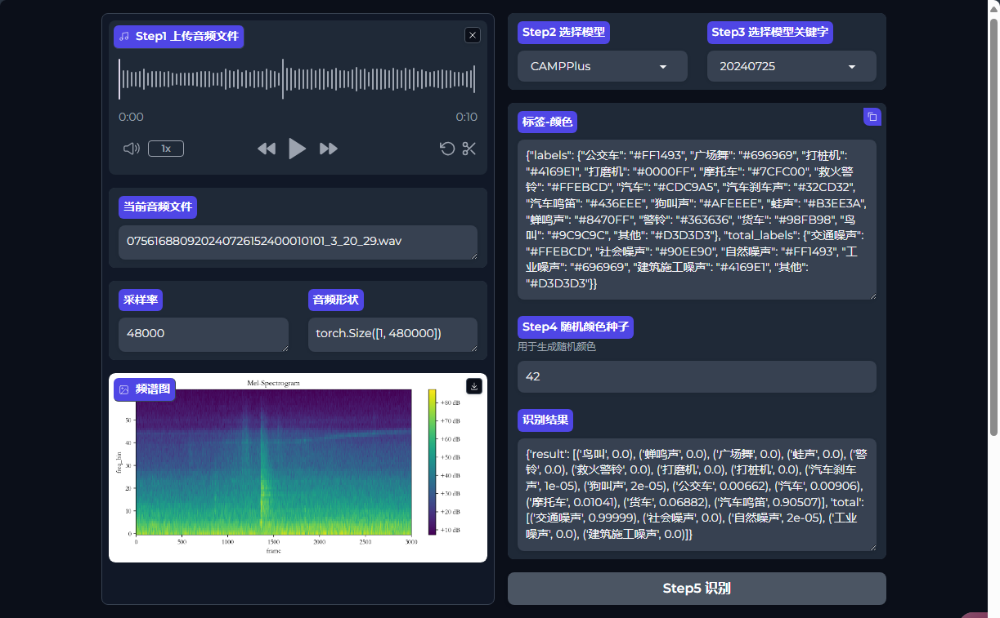
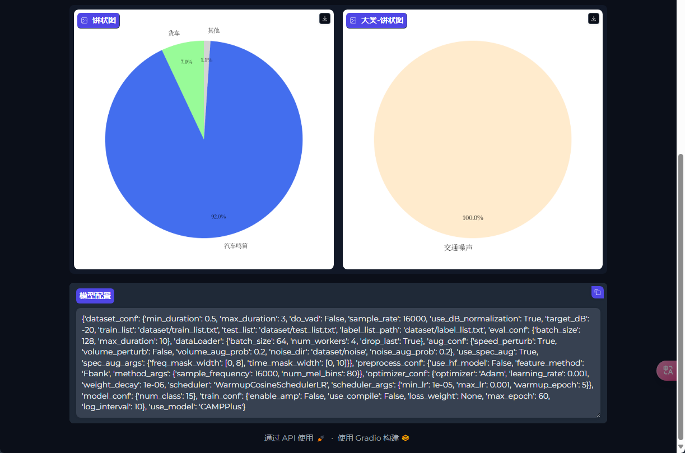

# 项目介绍

使用Gradio制作的音频识别交互界面。

> 基于的[yeyupiaoling/AudioClassification-Pytorch: The Pytorch implementation of sound classification supports EcapaTdnn, PANNS, TDNN, Res2Net, ResNetSE and other models, as well as a variety of preprocessing methods. (github.com)](https://github.com/yeyupiaoling/AudioClassification-Pytorch)的模型应用
>
> 
>
> 

# 运行

## 1、修改环境变量 `.env`

## 2、新增模型

1.在 `data/configs`, `data/dataset`, `data/models`下添加对应的模型配置、数据集label_list、模型文件

2.在 `data/supported_models.yml`中添加模型信息

### 示例：

文件

```
data
|> configs
||> cam++.yml
|> dataset
||> 20240725/label_list.txt
||> 20240725/label_dataframe.csv # 要有name和sources两列，sources为父类名称
|> models
||> 20240725/CAMPPlus_Fbank/best_model/model.pth
```

对应的 `data/supported_models.yml`里的内容

```yaml
CAMPPlus:
  "20240725": # 关键字，可以是其他
    label_list_path: "dataset/20240725"
    configs_path: "configs/cam++.yml"
    model_path: "models/20240725/CAMPPlus_Fbank/best_model"
```

## 3、创建基础环境

```bash
sudo docker build -f Dockerfile.base -t hycx.ac.app.base .
```

## 4、创建docker-image，container

```bash
docker-compose up -d
```
